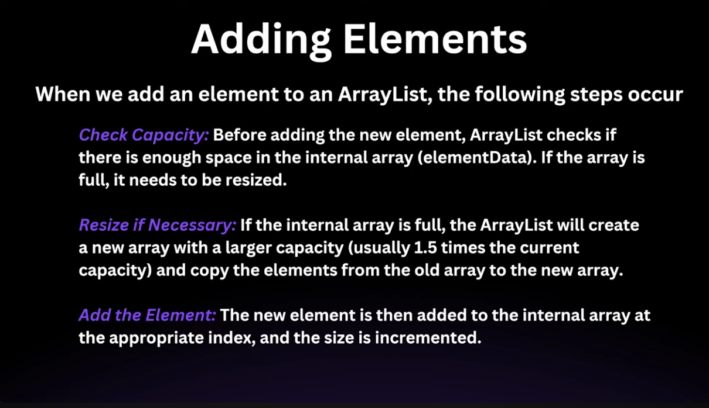

## 1. ArrayList

ArrayList is a resizable array implementation of the List interface in Java. It is part of the java.util package and
allows dynamic array operations (unlike arrays with fixed size).


* **Multiple null values can be stored**
* **Maintains insertion order**
* **Allows duplicate elements**
* **Supports random access via index (O(1) time)**

* Grows automatically when elements are added beyond its capacity
* Implements List Interface
* Not thread-safe by default. Use Collections.synchronizedList() for thread safety.
* Fast for random access (get(), set())
* Slower for insertions/removals in the middle (O(n) time)
* Default is 10; increases by 50% when resized

### Internal Working:

* **Backed by an array of type Object [ ].**
* When capacity is exceeded:
* A new larger array is created
* All old elements are copied to the new array

#### Constructors

| Constructor                            | Description                                          |
|----------------------------------------|------------------------------------------------------|
| `ArrayList()`                          | Creates an empty list with default capacity (10)     |
| `ArrayList(int initialCapacity)`       | Creates a list with specified initial capacity       |
| `ArrayList(Collection<? extends E> c)` | Creates a list with elements of the given collection |



| Category              | Method / Feature                 | Defined In      | Description                                                                 |
|----------------------|---------------------------------|-----------------|-----------------------------------------------------------------------------|
| Extra Method         | trimToSize()                    | ArrayList       | Reduces capacity to current size                                           |
| Extra Method         | ensureCapacity(int minCapacity) | ArrayList       | Increases internal capacity to avoid resizing overhead                     |
| Behavior Difference  | Resizable Array Implementation  | ArrayList       | Backed by dynamic array (contiguous memory)                                |
| Behavior Difference  | Allows Random Access            | ArrayList       | O(1) access via index (implements RandomAccess marker)                     |
| Behavior Difference  | Not Synchronized                | ArrayList       | Not thread-safe by default                                                 |
| Behavior Difference  | Allows Null Elements            | List (contract) | Permits null (ArrayList follows this)                                      |
| Behavior Difference  | Ordered Collection              | List (contract) | Maintains insertion order                                                  |
| Behavior Difference  | Duplicate Elements Allowed      | List (contract) | Allows duplicates                                                          |
| Behavior Difference  | Positional Access               | List (contract) | Index-based operations like get(), set(), add(index, element)              |

## Area Important

```java
import java.util.*;

public class RemoveComparison {
    public static void main(String[] args) {
        ArrayList<Integer> list = new ArrayList<>(Arrays.asList(1, 2, 3, 4));

        list.remove(1); // removes index 1 → element 2
        System.out.println("After remove(1): " + list);

        list.remove(Integer.valueOf(3)); // removes value 3
        System.out.println("After remove(Integer.valueOf(3)): " + list);
    }
}
```
