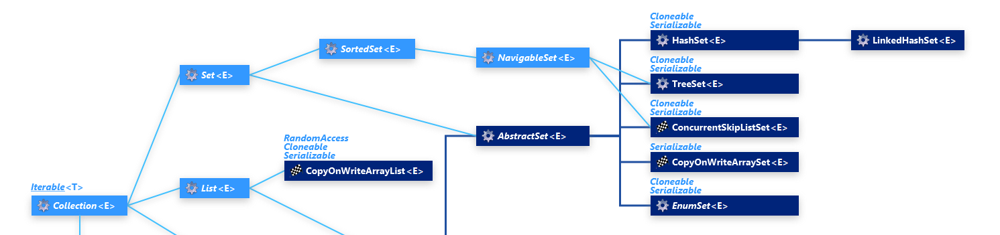

# Set
It is an unordered collection of objects in which duplicate values cannot be stored. It is an interface that implements the mathematical set. This interface adds a feature that restricts the insertion of duplicate elements.

No Specific Order: Does not maintain any specific order of elements (Exceptions: LinkedHashSet and TreeSet).

Allows One Null Element: Most Set implementations allow a single null element.

Implementation Classes: HashSet, LinkedHashSet, and TreeSet.

Thread-Safe Alternatives: For thread-safe operations, use ConcurrentSkipListSet or wrap a set using Collections.synchronizedSet().

Two interfaces extend the set implementation, that are, SortedSet and NavigableSet.

## Hierarchy

### implementations 
| Class           | Description                                                              |
| --------------- | ------------------------------------------------------------------------ |
| `HashSet`       | Backed by a `HashMap`; no ordering; allows one `null`                    |
| `LinkedHashSet` | Maintains insertion order; backed by a `LinkedHashMap`                   |
| `TreeSet`       | Sorted set based on natural order or a comparator; does not allow `null` |

| Use Case                                | Preferred Set   |
|-----------------------------------------|-----------------|
| No duplicates, no order required        | `HashSet`       |
| No duplicates, maintain insertion order | `LinkedHashSet` |
| No duplicates, sorted order required    | `TreeSet`       |
