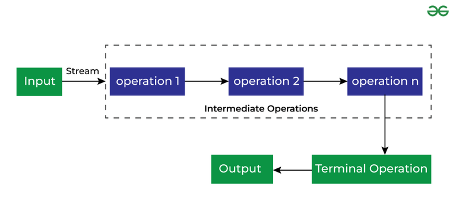

# Stream API

Stream was introduced in Java 8.

the Stream API is used to process collections of objects. A stream in Java is a sequence of objects that supports
various methods that can be pipelined to produce the desired result.

Use of Stream in Java.

* Stream API is a way to express and process collections of objects.
* Enable us to perform operations like filtering, mapping, reducing, and sorting.

<H6>Feature</h6>

* Not Modify the original list.


* **Intermediate operations are lazy - they are not executed until a terminal operation is invoked. They return a new stream, allowing multiple operations to be chained (pipelined). A terminal operation triggers the execution of the stream pipeline and produces a result or side effect.**

### Different Operations On Streams

There are two types of Operations in Streams:

**1. Intermediate Operations**
<p>These are the operations(methods) which will return you a stream.</p>

**2. Terminal Operations**
<p>These operations(methods) can return void or anything.</p>



* Example....

  `list.stream().filter((element)->{
  System.out.println(element);
  return element%2==0;

  });`

This way it doesn't execute because filter() is an intermediate operN (returns stream) so it will not execute.

**Methods in stream**
### 🔹 1. Stream Creation Methods

| Method                      | Description                        |
|-----------------------------|------------------------------------|
| `Stream.of(T...)`           | Creates a stream from values       |
| `List.stream()`             | Creates a stream from a collection |
| `Arrays.stream(array)`      | Creates a stream from an array     |
| `Stream.generate(Supplier)` | Creates an infinite stream         |
| `Stream.iterate(seed, op)`  | Infinite stream using a function   |
| `Stream.empty()`            | Returns an empty stream            |

---

## 🔹 2. Intermediate Operations (Lazy, Return New Stream)

#### 📌 a. Filtering and Slicing

| Method                 | Description                              |
|------------------------|------------------------------------------|
| `filter(Predicate)`    | Filters elements based on condition      |
| `distinct()`           | Removes duplicates                       |
| `limit(n)`             | Keeps only first `n` elements            |
| `skip(n)`              | Skips the first `n` elements             |
| `takeWhile(Predicate)` | Takes until condition is false (Java 9+) |
| `dropWhile(Predicate)` | Drops while condition is true (Java 9+)  |

#### 📌 b. Mapping (Transforming Elements)

| Method                          | Description                             |
|---------------------------------|-----------------------------------------|
| `map(Function)`                 | Transforms each element                 |
| `mapToInt(ToIntFunction)`       | Converts to `IntStream`                 |
| `mapToLong(ToLongFunction)`     | Converts to `LongStream`                |
| `mapToDouble(ToDoubleFunction)` | Converts to `DoubleStream`              |
| `flatMap(Function)`             | Flattens nested streams into one stream |
| `flatMapToInt()` etc.           | Flatten and convert to primitive stream |

#### 📌 c. Sorting

| Method               | Description               |
|----------------------|---------------------------|
| `sorted()`           | Sorts using natural order |
| `sorted(Comparator)` | Sorts with custom logic   |

#### 📌 d. Peeking

| Method           | Description                          |
|------------------|--------------------------------------|
| `peek(Consumer)` | For debugging, inspects elements     |

---

## 🔹 3. Terminal Operations (Trigger Execution)

#### 📌 a. Iteration & Collection

| Method                         | Description                         |
|--------------------------------|-------------------------------------|
| `forEach(Consumer)`            | Performs action on each element     |
| `forEachOrdered(Consumer)`     | Maintains order in parallel streams |
| `collect(Collectors.toList())` | Collects into a `List`              |
| `collect(Collectors.toSet())`  | Collects into a `Set`               |
| `collect(Collectors.toMap())`  | Collects into a `Map`               |
| `toArray()`                    | Converts to array                   |

#### 📌 b. Reduction & Aggregation

| Method                       | Description                          |
|------------------------------|--------------------------------------|
| `reduce(BinaryOperator)`    | Reduces elements into a single value |
| `reduce(identity, op)`      | With initial value                   |
| `count()`                   | Counts number of elements            |
| `min(Comparator)`           | Finds minimum element                |
| `max(Comparator)`           | Finds maximum element                |
| `anyMatch(Predicate)`       | Returns true if any match            |
| `allMatch(Predicate)`       | Returns true if all match            |
| `noneMatch(Predicate)`      | Returns true if none match           |
| `findFirst()`               | Gets the first element               |
| `findAny()`                 | Gets any element (parallel-safe)     |

---

### 4. Primitive Stream Methods (`IntStream`, `LongStream`, `DoubleStream`)

| Method                    | Description                            |
|---------------------------|----------------------------------------|
| `average()`              | Average of elements                     |
| `sum()`                  | Sum of elements                         |
| `min()` / `max()`        | Min or max values                       |
| `summaryStatistics()`    | Returns all stats (count, sum, etc.)   |
| `boxed()`                | Converts to `Stream<Integer>` etc.     |
| `asDoubleStream()`       | Converts to `DoubleStream`             |
| `asLongStream()`         | Converts to `LongStream`               |

---

##### 🔹 5. Short-Circuiting Operations

| Method                 | Description                              |
|------------------------|------------------------------------------|
| `anyMatch(Predicate)` | Stops when any match is found            |
| `allMatch(Predicate)` | Stops when a non-match is found          |
| `noneMatch(Predicate)`| Stops when a match is found              |
| `findFirst()`         | Stops after first element is found       |
| `findAny()`           | Stops after any element is found         |
| `limit(n)`            | Stops after `n` elements                 |


## Ways to create Streams

There are many ways to create a stream instance of different sources. Once created, the instance will not modify its
source, therefore allowing the creation of multiple instances from a single source.

1. **Empty Stream**

```
Stream<String> streamEmpty = Stream.empty();
```

2. **From Collections**

````
Collection<String> collection = Arrays.asList("a", "b", "c");
Stream<String> streamOfCollection = collection.stream();
````

3. **From Arrays**

````
String[] arr = new String[]{"a", "b", "c"};
Stream<String> streamOfArrayFull = Arrays.stream(arr);
Stream<String> streamOfArrayPart = Arrays.stream(arr, 1, 3);
````

4. **Stream.generate()**

    The generate() method accepts a Supplier<T> for element generation. As the resulting stream is infinite, 
    the developer should specify the desired size, or the generate() method will work until it reaches the memory limit:
````
Stream<String> streamGenerated =
Stream.generate(() -> "element").limit(10);
````
5. **From String**
```
IntStream streamOfChars = "abc".chars();
```

6. **From range**


    IntStream stream= IntStream.range(1,11);

7. **From values**


    Stream<String> st=Stream.of("abc","sdfa","asdf");

Example :-
```java
package Java8.StreamAPI;

import java.lang.reflect.Array;
import java.util.Arrays;
import java.util.List;
import java.util.stream.Collectors;
import java.util.stream.Stream;

public class StreamMethodsExample {

    public static void main(String[] args) {

        String [] arr=new String[]{"ram","shyam","kad","awesome","thai","alike"};
        Stream<String> stream= Arrays.stream(arr);

        System.out.println("----list---");
        Arrays.stream(arr).forEach(System.out::println);
        System.out.println("-------");

        //anyMatch()
        System.out.println("kad is in list (anyMatch()): "+stream.anyMatch(item->item.equalsIgnoreCase("kad")));
        //allMatch()
        System.out.println("all items contain a (allMatch()): "+Arrays.stream(arr).allMatch(item->item.contains("a")));
        //noneMatch()
        System.out.println("no items contain `a` (noneMatch()): "+ Arrays.stream(arr).noneMatch(item->item.contains("a")));
        System.out.println("find First word with 'am':(findFirst()): "+Arrays.stream(arr).filter(item->item.contains("am")).findFirst().get());
        System.out.println("find any word starts with a (findAny()): "+Arrays.stream(arr).filter(item->item.startsWith("a")).findAny().get());
        System.out.println("count the total no of items in list after filter (count()): "+Arrays.stream(arr).filter(item->item.startsWith("a")).count());
        System.out.println("collect the items in a list(collect()): "+Arrays.stream(arr).filter(item->item.startsWith("k")||item.endsWith("m")).collect(Collectors.toList()));


        int[] array=new int[]{1,12,23,3,4,5,6,8,7,23,1};

        //  Map
        System.out.println("map");
        Arrays.stream(array).map(x->x*2).forEach(System.out::println);

        //  Filter
        System.out.println("filter");
        Arrays.stream(array).filter(x->x%2==0).forEach(System.out::println);

        // distinct and sorted
        System.out.println("sorted and distinct");
        Arrays.stream(array).distinct().sorted().forEach(System.out::println);

        //  limit and skip
        System.out.println("limit and skip");
        Arrays.stream(array).limit(5).skip(2).forEach(System.out::println);

        //collect
        System.out.println("collect");
        List<Integer> list= Arrays.stream(array).boxed().filter(x->x>5).toList();
        list.forEach(System.out::println);


        // FLatMap (nested lists)
        int[][] nos=new int[][]{{1231321,342342342},{1231321231,234234234},{21231321,642342342}};

        List<Integer> phoneNos=Arrays.stream(nos)
        .flatMapToInt(Arrays::stream).boxed().collect(Collectors.toList());
        System.out.println(phoneNos);


    }

}
```