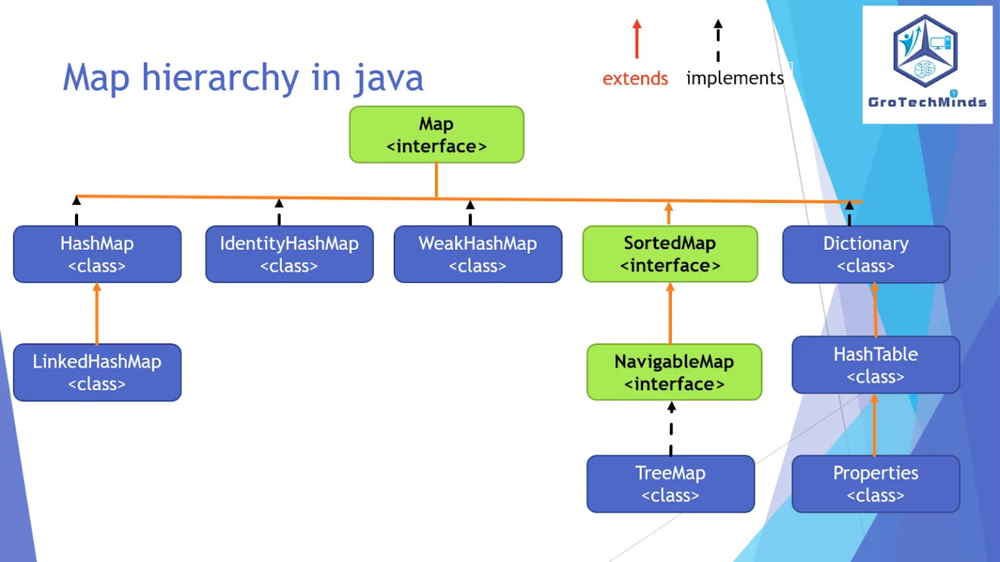

# Map
Map is a core interface in the Java Collections Framework that represents a key-value mapping structure.

Each key maps to exactly one value.

* Keys are unique

* Values can be duplicate

* Stores data in pair form (Entry<K, V>)

* Not a subtype of Collection

## Map Hierarchy


## 🧩 1. Key (K)

* Must be unique
* Used for retrieval
* Relies heavily on:
    * hashCode()
    * equals()

## 🧩 2. Value (V)

* Can be duplicate
* Can be null (depends on implementation)

## 🧩 3. Entry (Map.Entry<K,V>)

* Internal representation of each key-value pair

```java
interface Entry<K, V> {
    K getKey();
    V getValue();
}
```
**put(key, value)**

   → compute hash

   → locate bucket

   → store entry

**get(key)**

   → compute hash

   → find bucket

   → match key using equals()

